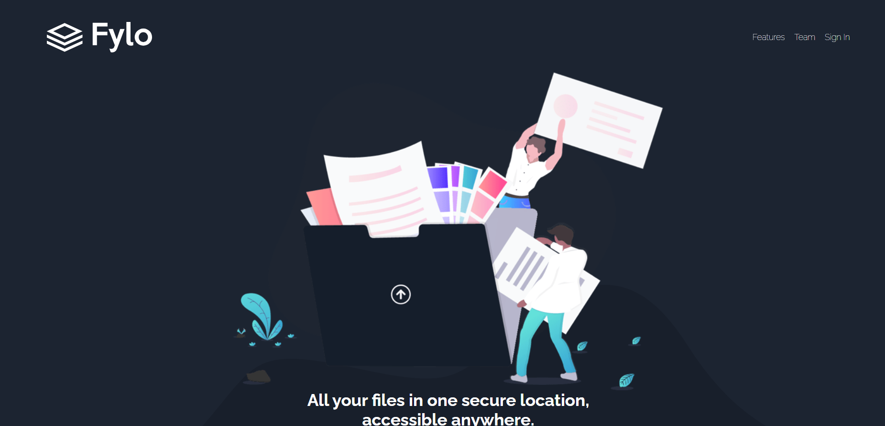
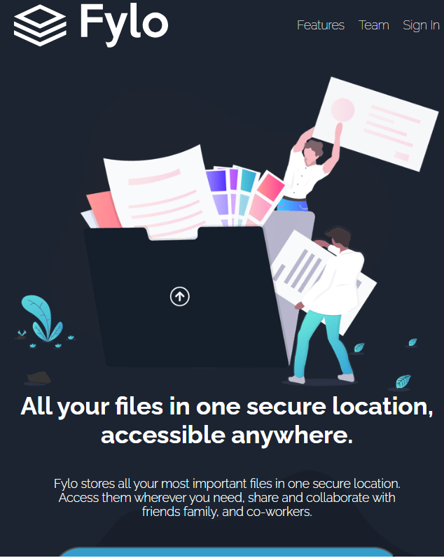

# Frontend Mentor - Fylo dark theme landing page Solution

This is my solution to the **[Fylo dark theme landing page challenge on Frontend Mentor](https://www.frontendmentor.io/solutions/fylo-dark-theme-landing-page-solution-xD0J81IpY1)**.
Frontend Mentor challenges help improve coding skills by building realistic projects.

## 📸 Design Preview

### Desktop

### Mobile

## 🔗 Links

- **Solution URL:** [https://github.com/Sarahndom/fylo-landing-page.git]
- **Live Site URL:** [https://fylo-landing-page-eight-swart.vercel.app/]

---

## 📚 Table of Contents
- Overview
- The Challenge
- Features
- Tech Stack
- What I Learned
- Continued Development
- Author

---

## 📝 Overview

The goal of this project was to build a full-page landing page based on the provided design for Fylo, a file storage service with a dark theme.

### The Challenge

Users should be able to:
- **View the optimal layout** for the site depending on their device's screen size (full **responsiveness**).
- **See hover states** for all interactive elements on the page (links, buttons, and form submission).

---

## 🌟 Features

- **Fully Responsive Layout:** Optimized for mobile, tablet, and desktop screens.
- **Semantic HTML5 Structure:** Used appropriate elements for navigation, sections, and content.
- **Dark Theme Implementation:** Utilized the provided color palette for a cohesive dark aesthetic.
- **Interactive Elements:** Implemented hover/focus states for the navigation, CTA buttons, and the email sign-up form.
- **Layout Management:** Effectively structured the page using modern CSS layout techniques.

---

## 🧰 Tech Stack

- **HTML5**
- **CSS3**
- **Flexbox / CSS Grid** (Primarily used for complex layout sections)

---

## ✨ What I Learned

During this challenge, I focused on improving my skills in:

- **Handling Background Graphics:** Precisely positioning the unique background curve/blob shape in the hero section and throughout the page to match the design.
- **Responsive Typography and Spacing:** Using a combination of `rem` and percentage units to manage fluid text sizes and vertical rhythm across different breakpoints.
- **CSS Custom Properties (Variables):** Leveraging variables defined in the `style-guide.md` to manage the dark color palette efficiently and ensure consistency.
- **Building a Testimonial Grid/Layout:** Structuring the testimonial cards using CSS Grid or Flexbox to maintain the intended alignment and card dimensions.

